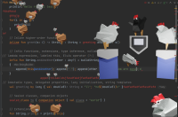
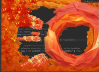
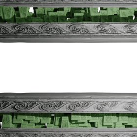
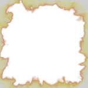

# Zeranthium Extras

Assets to show different possibilities with the Powermode Zeranthium  plugin

For more info see <a href="https://cschar.github.io/power-mode-zeranthium/"> Zeranthium Docs </a>

# Instructions:

## manual:
1. Clone this repo
2. <kbd>Settings/Preferences</kbd> > <kbd>Plugins</kbd> > <kbd>⚙️</kbd> > <kbd>Powermode Zeranthium</kbd> > <kbd> packs </kbd> > <kbd> custom pack file </kbd> > <kbd> load pack </kbd>
3. Select a manifest.json in one of the pack folders

## in-plugin:
1. <kbd>Settings/Preferences</kbd> > <kbd>Plugins</kbd> > <kbd>⚙️</kbd> > <kbd>Powermode Zeranthium</kbd> > <kbd> packs </kbd> > <kbd> zeranthium-extras-vol1</kbd> > <kbd> DOWNLOAD </kbd> 
2. wait for download process to complete...
3.  <kbd> load pack </kbd>